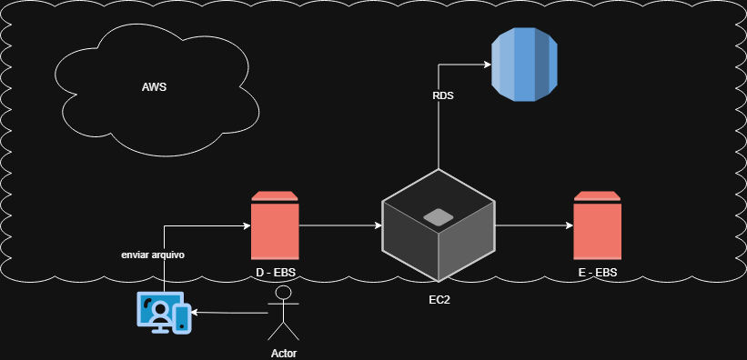
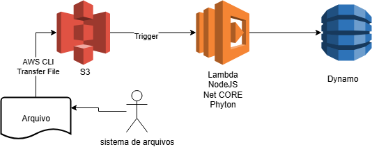

# ☁️ Gerenciando Instâncias EC2 na AWS

## 📦 AMIs (Amazon Machine Images)
No Amazon EC2, uma **AMI** é uma imagem de máquina virtual pré-configurada que inclui todas as informações necessárias para iniciar uma instância, como o sistema operacional, servidores e aplicações.

### Principais pontos:
1. **Criação**: AMIs podem ser criadas a partir de instâncias em execução ou paradas, capturando um snapshot completo do ambiente.  
2. **Públicas e Privadas**:  
   - AMIs públicas → fornecidas pela AWS ou pela comunidade.  
   - AMIs privadas → criadas pelo próprio usuário, mais seguras e personalizadas.  
3. **Personalização**: É possível configurar uma instância do jeito que você precisa e depois gerar uma AMI dela, facilitando a replicação do ambiente.  
4. **Execução de instâncias**: Para iniciar uma instância no EC2, você deve selecionar uma AMI, que define informações como o volume raiz e permissões de inicialização.  
5. **Tipos de AMI**: Amazon Linux, Windows e outras opções de sistemas operacionais.  

---

## 💾 Snapshots EBS
O **Amazon EBS (Elastic Block Store)** é um serviço IaaS que permite anexar volumes a instâncias EC2.  
Os **snapshots EBS** são usados como mecanismo de backup nativo da AWS.

### Principais pontos:
- São cópias pontuais (backups) de volumes EBS.  
- Podem ser configurados com frequência automática.  
- Os snapshots ficam armazenados no **Amazon S3**, em infraestrutura separada dos volumes originais.  
- Custos podem variar de acordo com a região.  

### Diferença entre AMI e Snapshot:
- **AMI** → backup completo de uma instância (inclui sistema operacional e todos os volumes EBS anexados).  
- **Snapshot** → cópia de um volume EBS específico.  

---

## 📝 Desafio prático
Criar o desenho de uma arquitetura que utilize **S3 + EC2 + Lambda Function** no [draw.io](https://draw.io).  

### Diagramas criados no draw.io 

  
  
